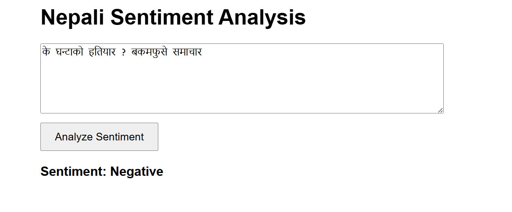
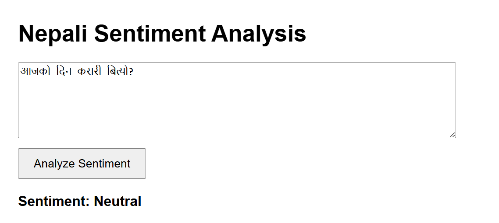
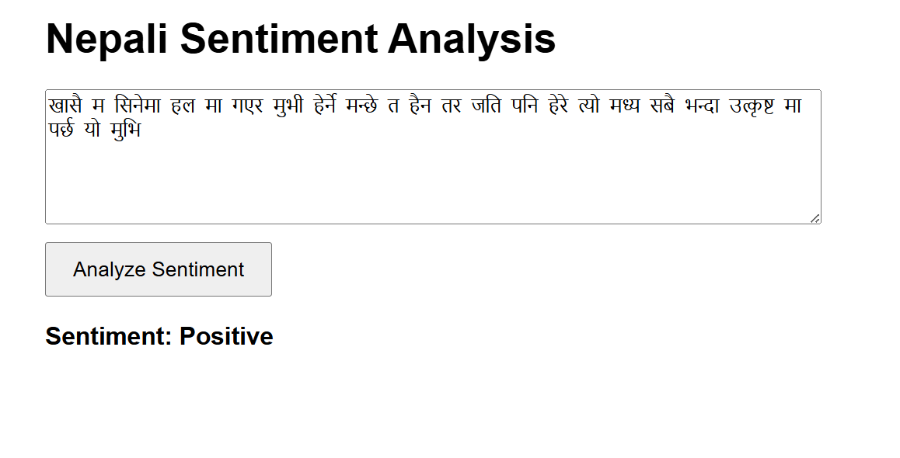

# Nepali Sentiment Analyzer

This is a simple Flask web application that predicts the sentiment of Nepali text as Positive, Negative, or Neutral.
Note *** The model may make mistakes as it is trained on a relatively small dataset (~1000 samples)***

The model uses TF-IDF vectorization and Logistic Regression, trained on Nepali comments and posts collected from Facebook, YouTube, TikTok, news articles, and Twitter.


## Features

- Input Nepali text in the web form  
- Predict sentiment instantly  
- Shows result on the same page  

---

## Project Structure

<pre> ``` nepali-sentiment-analyzer/ ├── app.py → Main Python file that runs the web app ├── requirements.txt → List of Python packages needed to run the app ├── README.md → Info and guide about the project ├── model_files/ → Folder that stores trained machine learning files │ ├── sentiment_model.pkl → The trained model file │ └── tfidf_vectorizer.pkl → The text converter (TF-IDF) used by the model ├── templates/ → Folder that stores HTML files │ └── index.html → The webpage where users input text ``` </pre>


* Create a virtual environment and activate it:
python -m venv venv
source venv/bin/activate    # On Windows: venv\Scripts\activate

* Install required packages:
pip install -r requirements.txt
Start the Flask app:

python app.py
Open your browser and visit:

http://127.0.0.1:5000

* How to Use
Enter Nepali text into the input box

 Click Submit

 View the predicted sentiment on the page

* Requirements
  Flask
  scikit-learn
  joblib
  
  ## 📸 Sample Screenshots
  
  <p align="center">
  
  
  
</p>

